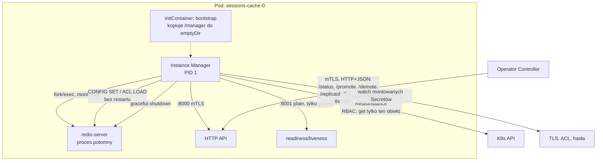
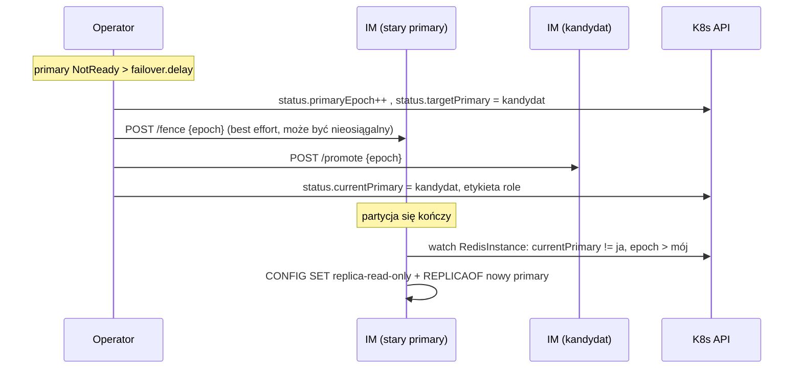
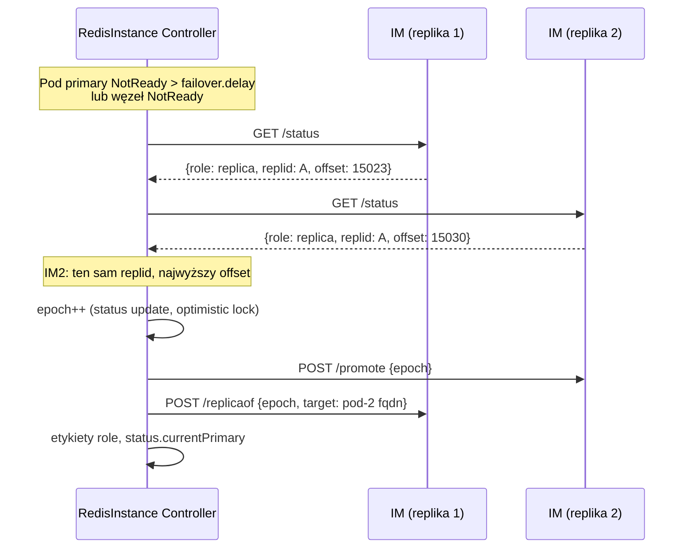
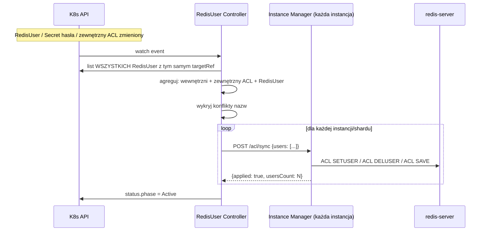
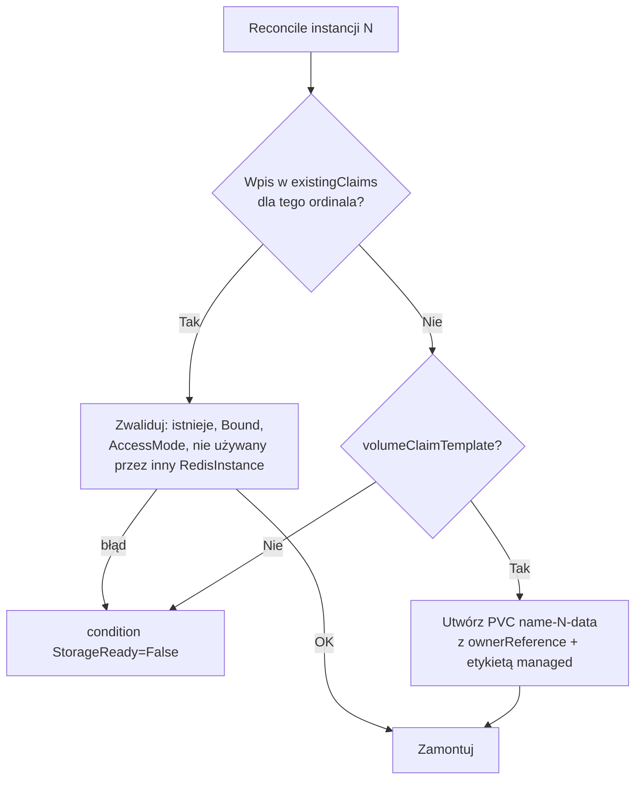
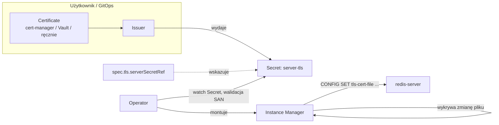
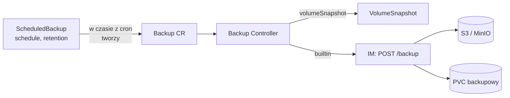
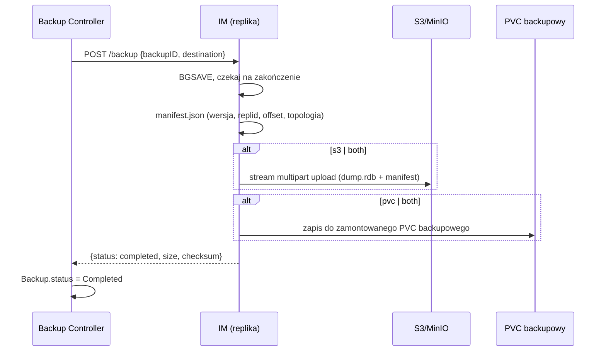
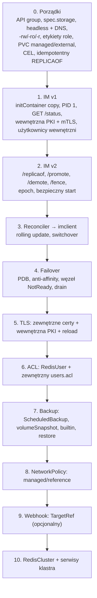

# Redis Operator — plan master

Jedyny obowiązujący dokument architektoniczny. Zastępuje wcześniejsze pliki (`redis-operator-plan.md`, `redis-operator-cnpg-style.md`, `redis-operator-final-model.md`). Zawiera tylko decyzje w aktualnej wersji. Decyzje odrzucone są opisane w sekcji 14, razem z uzasadnieniem.

**API group:** `redis.operator.com/v1`. Prefiks adnotacji i etykiet operatora: `redis.operator.com/`.

---

## 1. Filozofia — wzorzec CloudNativePG + Strimzi

Operator działa na zasadzie **deklaratywnego "zamawiania"**: użytkownik opisuje, czego chce (instancja, klaster, użytkownik, backup), a operator wykonuje wszystkie niskopoziomowe operacje. Użytkownik nie dotyka bezpośrednio Poda, PVC ani komend administracyjnych Redisa.

| Wzorzec | Zapożyczony z | Zastosowanie u nas |
|---|---|---|
| Pody zarządzane bezpośrednio (nie StatefulSet) | CloudNativePG | Pełna kontrola nad cyklem życia każdej instancji z osobna |
| Instance Manager (binarka jako PID 1 w kontenerze) | CloudNativePG | Lokalne decyzje: promocja, fencing, reload TLS/ACL, graceful shutdown |
| Binarka IM kopiowana initContainerem | CloudNativePG | Działa z upstreamowym obrazem `redis`/`valkey`, bez własnego obrazu bazy |
| `TargetRef` — satelickie CRD referencujące właściciela danych | Strimzi (`KafkaUser`→`Kafka`) | `RedisUser`, `Backup`, `ScheduledBackup` wskazują na `RedisInstance`/`RedisCluster` |
| Bring-your-own dla TLS, userów/ACL i PVC | CloudNativePG | Operator konsumuje gotowe zasoby, a gdy ich nie podano, generuje własne |
| `-rw`/`-ro`/`-r` nazewnictwo Service | CloudNativePG | Czytelny, przewidywalny dostęp do primary i replik |
| Kubernetes API (etcd) jako jedyne źródło prawdy o topologii | CloudNativePG | Brak zewnętrznego mechanizmu konsensusu (Sentinel) — patrz sekcja 14 |

### Wspierane silniki i wersje

Minimum to **Redis 7.2 / Valkey 7.2**. Uzasadnienie:
- `cluster-announce-hostname` i `cluster-preferred-endpoint-type` (od 7.0) są potrzebne do stabilnego DNS w `RedisCluster`.
- `CLUSTER SHARDS` jest dostępne od 7.0.
- 7.2 to ostatni Redis na licencji BSD. Od 7.4 Redis jest na RSAL/SSPL, a od 8.0 na RSAL/SSPL/AGPL. Valkey (BSD, fork 7.2) jest traktowany jako pełnoprawny silnik docelowy.

Silnik wybiera użytkownik przez `spec.image`. Instance Manager wykrywa wersję i silnik przez `INFO server` i raportuje je w statusie.

---

## 2. CRD — pełny model

```mermaid
graph TB
    RI[RedisInstance<br/>primary + N replik]
    RC[RedisCluster<br/>M shardów]
    RU[RedisUser]
    BK[Backup]
    SBK[ScheduledBackup]

    RU -->|targetRef| RI
    RU -->|targetRef| RC
    BK -->|targetRef| RI
    BK -->|targetRef| RC
    SBK -->|targetRef, tworzy| BK

    PVC1[(Zewnętrzny PVC)]
    PVC2[(PVC generowany przez operator)]
    TLS1[Zewnętrzny Secret TLS<br/>np. cert-manager]
    ACL1[Zewnętrzny Secret ACL<br/>np. Vault/ESO]

    RI -.existingClaims.-> PVC1
    RI -.volumeClaimTemplate.-> PVC2
    RI -.tls.serverSecretRef.-> TLS1
    RI -.acl.externalSecretRef.-> ACL1
```

| CRD | Właściciel danych? | Kluczowe pola |
|---|---|---|
| `RedisInstance` | Tak | `instances`, `storage`, `tls`, `acl`, `networkPolicy`, `replication`, `bootstrap` |
| `RedisCluster` | Tak | `shards`, `instancesPerShard`, `instanceTemplate` |
| `RedisUser` | Nie (autoryzacja) | `targetRef`, `username`, `authentication`, `acl.rules` |
| `Backup` | Nie | `targetRef`, `method: volumeSnapshot \| builtin`, `builtin.destination` |
| `ScheduledBackup` | Nie | `targetRef`, `schedule`, `backupTemplate`, `retention` |

Restore nie jest osobnym CRD. Robi się go przez `spec.bootstrap` nowego `RedisInstance`/`RedisCluster` (sekcja 10), tak jak w CNPG.

### Wspólny wzorzec `TargetRef`

```go
type TargetRef struct {
    // +kubebuilder:validation:Enum=RedisInstance;RedisCluster
    Kind string `json:"kind"`
    Name string `json:"name"`
}
```

Jeden typ Go i jedna funkcja `resolveTarget(ctx, ref) (client.Object, error)`, używana zarówno przez webhook, jak i przez kontrolery (sekcja 12).

---

## 3. RedisInstance — silnik bazowy (primary + repliki)

### Pody zarządzane bezpośrednio, nie StatefulSet

Każda instancja ma jawną, przewidywalną nazwę (`<name>-0`, `<name>-1`, ...). Tworzy ją i usuwa jawnie Reconciler. Ordinal to **tożsamość**, a nie rola. Rola (`primary`/`replica`) jest zapisana w `status.currentPrimary` i w etykiecie `redis.operator.com/role`.

Każdy Pod ma ustawione `spec.hostname: <name>-<ordinal>` i `spec.subdomain: <name>-hl`, dzięki czemu dostaje stabilny DNS:

```
<name>-<ordinal>.<name>-hl.<namespace>.svc.cluster.local
```

**Replikacja zawsze używa nazw DNS, nigdy Pod IP.** Pod IP zmienia się przy każdym restarcie Poda, więc `REPLICAOF <PodIP>` zrywa replikację po restarcie primary. Redis dostaje `replica-announce-ip <fqdn>`, żeby w `INFO replication` pokazywał nazwy DNS.

### Kształt spec

```yaml
apiVersion: redis.operator.com/v1
kind: RedisInstance
metadata:
  name: sessions-cache
spec:
  instances: 3
  image: valkey/valkey:8.0
  storage:
    volumeClaimTemplate:
      size: 5Gi
      storageClassName: fast-ssd
    existingClaims: []            # sekcja 6
  replication:
    minReplicasToWrite: 1         # 0 = wyłączone; sekcja 3.3
    minReplicasMaxLag: 10
  failover:
    delay: 30s                    # ile primary może być NotReady przed failoverem
  affinity:
    podAntiAffinityType: required # required | preferred
  tls: {}                         # sekcja 7
  acl: {}                         # sekcja 8
  networkPolicy: {}               # sekcja 9
  bootstrap: {}                   # sekcja 10 (restore)
  redis:
    persistence: aof              # aof | rdb | none
    modules: []                   # sekcja 3.7
```

### Instance Manager — serce wzorca



**Dystrybucja binarki.** Obraz operatora zawiera binarkę `manager`. InitContainer (obraz operatora) kopiuje ją do współdzielonego `emptyDir`, a kontener `redis` (obraz użytkownika, np. `redis:7.2`) ma nadpisany `command: ["/controller/manager", "instance", "run"]`. Dzięki temu nie trzeba budować własnego obrazu Redisa, a użytkownik może podać dowolny zgodny obraz Redis/Valkey.

**Transport: HTTP + JSON, nie gRPC.** Łatwiej go debugować (`curl`), nie wymaga toolchainu `protoc`/`buf`, a CNPG robi tak samo. Komunikacja jest ukryta za interfejsem, żeby transport dało się wymienić:

```go
type InstanceManagerClient interface {
    Status(ctx context.Context) (InstanceStatus, error)
    Promote(ctx context.Context, epoch int64) error
    Demote(ctx context.Context, epoch int64, primaryHost string) error
    ReplicaOf(ctx context.Context, epoch int64, primaryHost string) error
    Fence(ctx context.Context, epoch int64) error
    ReloadTLS(ctx context.Context) error
    SyncACL(ctx context.Context, users []ACLUser) error
}
```

Dlaczego Instance Manager, a nie operator łączący się bezpośrednio z Redisem:
1. **Lokalne decyzje bez roundtripu** — reload certu/ACL i fencing dzieją się w Podzie, natychmiast.
2. **Bezpieczny start** — IM decyduje, w jakiej roli uruchomić `redis-server` (sekcja 3.3), zanim proces przyjmie pierwsze połączenie.
3. **Graceful shutdown** — przy SIGTERM na primary IM najpierw robi switchover (jeśli jest zdrowa replika), a dopiero potem zatrzymuje `redis-server`. Na replice po prostu zamyka proces.
4. **Bogaty status** — offset replikacji, lag, `master_replid`, `cluster_state`, epoch.
5. **Idempotencja** — `POST /replicaof` najpierw sprawdza `INFO replication` i nic nie robi, jeśli replika już jest podpięta do właściwego primary z `master_link_status:up`. Obecne `setReplicaOf` w każdym reconcile (bez sprawdzenia stanu) zostanie usunięte.

### 3.1 Bezpieczeństwo API Instance Managera

API IM pozwala promować, degradować i zmieniać ACL, więc bez uwierzytelnienia każdy Pod w klastrze mógłby przejąć bazę. Dlatego:

- Operator utrzymuje **wewnętrzne PKI dla IM** (CA per operator, Secret w namespace operatora; certyfikat serwerowy per `RedisInstance`). To PKI jest **zawsze** generowane przez operator i jest niezależne od TLS Redisa z sekcji 7.
- Port `:8000` (API) wymaga mTLS: IM akceptuje tylko certyfikat klienta z CN operatora.
- Port `:8001` (probes) wystawia tylko `/healthz` i `/readyz`, bez żadnych mutacji.
- Operator zawsze tworzy wbudowaną NetworkPolicy pozwalającą na ruch do `:8000` tylko z Podów operatora. Jest ona niezależna od `spec.networkPolicy.mode`, bo to element bezpieczeństwa operatora, a nie aplikacji.

### 3.2 Użytkownicy wewnętrzni

Operator generuje Secret `<name>-internal-auth` z dwoma zarezerwowanymi użytkownikami Redisa:

| User | Uprawnienia | Użycie |
|---|---|---|
| `_operator` | `+@all ~* &*` | IM → lokalny `redis-server` (admin, ACL, CONFIG) |
| `_replication` | `+psync +replconf +ping` | `masteruser`/`masterauth` replik |

Nazwy z prefiksem `_` są zarezerwowane. `RedisUser` i zewnętrzny ACL nie mogą ich używać (walidacja CEL + IM).

Użytkownik `default` jest domyślnie **wyłączony** (`user default off`). Można go jawnie włączyć przez `spec.acl.defaultUser: enabled` (np. dla środowiska deweloperskiego).

### 3.3 Split-brain, fencing i ochrona przed pustym primary

To trzy najważniejsze mechanizmy poprawności. Muszą powstać **przed** automatycznym failoverem.

#### Epoch (generacja primary)

`status.primaryEpoch` (int64) rośnie przy każdej zmianie primary. Każda mutacja w IM (`/promote`, `/demote`, `/replicaof`, `/fence`) niesie epoch:
- IM zapisuje ostatni widziany epoch na PVC (`/data/.operator/epoch`).
- IM **odrzuca** polecenie z epoch mniejszym niż zapisany (HTTP 409). To chroni przed opóźnionym poleceniem ze starego lidera operatora (np. po zmianie leadera w leader election).

#### Fencing starego primary



- **Aktywny fencing:** `POST /fence` przełącza Redis w tryb odrzucający zapisy (`CLIENT PAUSE WRITE` bez timeoutu) i rozłącza klientów.
- **Samo-fencing:** IM watchuje własny `RedisInstance`. Jeśli `status.currentPrimary` wskazuje inny Pod, a `status.primaryEpoch` jest wyższy niż lokalny, IM sam degraduje swój Redis do repliki.
- **Utrata kontaktu z API serwerem:** jeśli IM na primary nie może odczytać swojego `RedisInstance` dłużej niż `failover.delay`, sam się fencuje. Taniej jest chwilowo odrzucić zapisy niż ryzykować dwa primary.
- **Selector `-rw`** opiera się na etykiecie `role=primary`. Operator zdejmuje ją ze starego Poda przed nadaniem nowemu, więc ruch Service nigdy nie trafia do dwóch primary jednocześnie.
- **Granica utraty danych:** replikacja Redisa jest asynchroniczna. `spec.replication.minReplicasToWrite` → `min-replicas-to-write`/`min-replicas-max-lag` sprawia, że izolowany primary sam przestaje przyjmować zapisy. Domyślnie `0`, bo przy `instances: 1` blokowałoby to wszystkie zapisy. Dokumentacja musi to jasno opisać.

#### Bezpieczny start — ochrona przed pustym primary

Klasyczny problem Redisa: primary restartuje się z pustym datasetem (brak persystencji albo uszkodzony RDB), repliki robią pełny resync i **kasują swoje dane**.

Reguła IM przy starcie Poda:
1. IM odczytuje `RedisInstance` z API.
2. Jeśli `status.currentPrimary != ja` → start `redis-server` od razu z `replicaof <currentPrimary-fqdn>`.
3. Jeśli `status.currentPrimary == ja` → start z `replicaof no one`, ale **w trybie fenced** (zapisy wstrzymane). IM raportuje `offset`, `master_replid` i rozmiar datasetu. Operator porównuje to z replikami:
   - dane spójne (ten sam `replid`, offset ≥ offsetów replik) → operator zdejmuje fence;
   - dane puste lub starsze niż na którejś replice → operator robi **failover na najlepszą replikę** (epoch++), a ten Pod startuje jako replika.
4. Persystencja jest domyślnie włączona (`appendonly yes`, `appendfsync everysec` + RDB). Wyłączyć ją można tylko jawnie przez `spec.redis.persistence: none`. Wtedy punkt 3 zawsze kończy się failoverem, jeśli jest dostępna replika.

### 3.4 Failover — wybór kandydata



Kryteria wyboru: ten sam `master_replid` co ostatnio znany primary, najwyższy `master_repl_offset`, `master_link_status` niedawno `up`. Remis rozstrzyga niższy ordinal (determinizm).

**Planowany switchover** przez `kubectl annotate redisinstance sessions-cache redis.operator.com/promote=sessions-cache-2`. Przebieg: fence primary → czekanie, aż kandydat dogoni offset (zero lag) → promote → demote starego. Awaryjny failover nie czeka na zerowy lag (odpowiedź na dawną otwartą decyzję #2).

### 3.5 Odporność na awarie węzłów i drain

- **PodDisruptionBudget** generowany automatycznie:
  - PDB dla replik: `maxUnavailable: 1`.
  - PDB dla primary: `minAvailable: 1`. Drain węzła z primary jest blokowany, dopóki operator nie zrobi switchoveru. Operator wykrywa cordon na węźle primary i sam inicjuje switchover.
- **Anti-affinity** po `redis.operator.com/instance`, domyślnie `required` (instancje na różnych węzłach), z opcją `preferred` dla małych klastrów.
- **Węzeł NotReady:** Pod na martwym węźle wisi w `Terminating`/`Unknown`, bo nie ma kontrolera, który by go przeniósł. Operator:
  1. traktuje go jako niedostępny po `failover.delay` → failover, jeśli to primary;
  2. nie usuwa siłowo Poda, dopóki węzeł może wrócić (ryzyko podwójnego montowania RWO);
  3. jeśli węzeł ma taint `node.kubernetes.io/out-of-service` (Kubernetes non-graceful node shutdown), operator usuwa Pod i odtwarza instancję na innym węźle. Zależnie od storage będzie to ten sam PVC (storage sieciowy) albo nowy (storage lokalny, opcja `spec.storage.recreateOnNodeLoss: true`, tylko dla PVC generowanych).

### 3.6 Update istniejących Podów

Zmiana `spec.image` lub konfiguracji, która wymaga restartu, uruchamia rolling update: najpierw repliki (po jednej, czekając na `master_link_status:up` i nadrobienie lagu), na końcu switchover primary na zaktualizowaną replikę i restart starego primary. Zmiany, które da się zastosować przez `CONFIG SET`, idą bez restartu.

### 3.7 Moduły Redisa

```yaml
spec:
  redis:
    modules:
      - name: crdt
        image: registry.example.com/redis-crdt-module:0.1.0   # obraz z plikiem .so
        path: /modules/crdt.so
        args: ["--site-id", "a"]
```

- Operator dodaje initContainer z obrazu modułu, który kopiuje `.so` do współdzielonego `emptyDir` (`/modules`), tak jak binarkę IM. Obraz silnika zostaje upstreamowy.
- IM uruchamia `redis-server` z `--loadmodule <path> <args...>` i raportuje załadowane moduły (`MODULE LIST`) w statusie.
- Zmiana listy modułów wymaga restartu `redis-server`, więc idzie przez rolling update (sekcja 3.6).
- To ogólny mechanizm (przydaje się też np. dla modułów JSON i wyszukiwania), a jednocześnie punkt integracji dla przyszłego modułu active-active (sekcja 18).

Silnik jest w IM ukryty za interfejsem `Engine` (start, konfiguracja, `INFO`, replikacja). Dzięki temu da się później podpiąć obok niego dodatkowy proces (np. syncer active-active) bez przepisywania IM.

---

## 4. Services — dostęp do danych

### RedisInstance

| Service | Typ | Selector | Użycie |
|---|---|---|---|
| `<name>-rw` | ClusterIP | `role=primary` | Zapisy i odczyty z primary |
| `<name>-ro` | ClusterIP | `role=replica` | Odczyty **tylko** z replik |
| `<name>-r` | ClusterIP | wszystkie instancje | Odczyty z dowolnej instancji (w tym primary) |
| `<name>-hl` | Headless (`publishNotReadyAddresses: true`) | wszystkie instancje | Stabilny DNS per Pod, replikacja, IM |

Gwarancja braku zapisów na `-ro`/`-r` jest wymuszona na dwóch poziomach:
1. Redis: `replica-read-only yes` na replikach (wymuszone przez IM, użytkownik nie może tego nadpisać). Zapis kończy się błędem `READONLY You can't write against a read only replica.`
2. Opcjonalnie ACL: `RedisUser` może mieć `spec.acl.replicaRules`. Wtedy użytkownik na replikach dostaje np. tylko `+@read`. Przydaje się dla aplikacji, które mają fizycznie nie móc pisać nawet po failoverze. **Uwaga:** reguły replik trzeba przepisać po każdej zmianie ról, więc wykonuje to IM przy `/promote`/`/demote`.

Uwaga dla użytkowników: `-r` zawiera primary, więc zapis przez `-r` może się czasem udać, a czasem nie. Dokumentacja musi to jasno opisać. Do zapisów służy tylko `-rw`.

Przy `instances: 1` Service `-ro` nie ma endpointów. Tworzymy go mimo to, żeby nazwy były przewidywalne.

### RedisCluster (etap późniejszy)

| Service | Typ | Użycie |
|---|---|---|
| `<name>` | ClusterIP, wszystkie node'y | Seed dla klientów cluster-aware (topologię odkrywają przez `CLUSTER SHARDS`) |
| `<name>-hl` | Headless | Stabilny DNS per node, cluster bus (port 16379) |

- `cluster-announce-hostname <fqdn>` + `cluster-preferred-endpoint-type hostname` sprawiają, że klienci dostają w przekierowaniach `MOVED`/`ASK` nazwy DNS zamiast IP.
- Odczyty z replik: klient wysyła `READONLY` na połączeniu do repliki (standard Redis Cluster). Operator nie może tego wymusić na poziomie Service, bo routing robi klient, a nie Service.
- Dostęp spoza klastra K8s jest trudny (każdy node musi być osiągalny osobno). Odkładamy to: opcja `LoadBalancer` per node dopiero, gdy będzie potrzebna.

---

## 5. RedisUser — autoryzacja jako osobny manifest

Wzorzec identyczny do `KafkaUser` w Strimzi. Jeden duży plik ACL w Secrecie ma wady: konflikty w Git, brak granularnego RBAC, brak `kubectl get` per user. Osobny CR to rozwiązuje. Jest to jedno z trzech źródeł użytkowników (sekcja 8).

```yaml
apiVersion: redis.operator.com/v1
kind: RedisUser
metadata:
  name: checkout-service
spec:
  targetRef:
    kind: RedisCluster
    name: orders-cluster
  username: checkout-service
  authentication:
    passwordSecretRef:            # zewnętrzny Secret (np. z Vault/ESO)
      name: checkout-service-redis-password
      key: password
    # ALBO: generate: true -> operator tworzy Secret <name>-redis-user
  acl:
    rules:
      - "~orders:*"
      - "~checkout:session:*"
      - "+@read"
      - "+@write"
      - "-@admin"
      - "-@dangerous"
    replicaRules:                 # opcjonalne, sekcja 4
      - "~orders:*"
      - "+@read"
status:
  phase: Active
  syncedAt: "2026-08-19T10:00:00Z"
  conditions: []
```



Kluczowe decyzje:
- Kontroler przelicza **cały pożądany zbiór userów** przy każdej zmianie, a nie pojedynczego usera. Eliminuje to race condition przy równoległych zmianach.
- Do IM trafiają **hashe haseł** (`#<sha256>`), nigdy plaintext.
- Finalizer na `RedisUser` gwarantuje `ACL DELUSER` przed usunięciem CR z etcd.
- Rotacja hasła: watch na `passwordSecretRef` jest traktowany jak zmiana samego `RedisUser`. W czasie rotacji można mieć dwa hasła jednocześnie (`>old >new`), jeśli Secret zawiera klucz `previousPassword`.
- `RedisCluster`: sync idzie do **wszystkich node'ów wszystkich shardów** (ACL nie propaguje się między node'ami).
- Nowa instancja (skalowanie, odtworzenie po failoverze) dostaje pełny ACL od IM przy starcie, zanim zacznie przyjmować ruch (readiness dopiero po `/acl/sync`).

---

## 6. Storage — PVC generowany lub zewnętrzny

```yaml
spec:
  storage:
    volumeClaimTemplate:          # operator generuje PVC
      size: 5Gi
      storageClassName: fast-ssd
    existingClaims:               # część lub wszystkie instancje na zewnętrznych PVC
      - instanceOrdinal: 0
        claimName: sessions-cache-restored-from-snapshot
```



**Cykl życia — reguła jest prosta: kto tworzy, ten usuwa.**

| PVC | ownerReference | Usunięcie `RedisInstance` | Skalowanie w dół |
|---|---|---|---|
| Generowany (`volumeClaimTemplate`) | Tak | Usunięty (GC) | Usunięty |
| Zewnętrzny (`existingClaims`) | **Nie** | Zostaje | Zostaje (tylko odmontowany) |

- Operator oznacza własne PVC etykietą `redis.operator.com/managed-pvc: "true"`. Przed jakimkolwiek `Delete` sprawdza **zarówno** etykietę, jak i ownerReference. To podwójne zabezpieczenie przed usunięciem cudzego zasobu przez błąd w kodzie.
- Zewnętrzny PVC zostaje oznaczony adnotacją `redis.operator.com/attached-to: <ns>/<name>/<ordinal>`, żeby wykryć próbę podpięcia go do dwóch instancji. Adnotację zdejmuje finalizer przy odłączeniu.
- Kto chce zachować dane po usunięciu CR, robi przedtem Backup (sekcja 10) albo używa `existingClaims`.

---

## 7. TLS / mTLS — zewnętrzne certyfikaty albo wewnętrzna PKI

Dwa niezależne obszary:
1. **TLS Redisa** (klienci ↔ Redis, replikacja, cluster bus) — konfigurowalny, opisany tutaj.
2. **mTLS operator ↔ IM** — zawsze wewnętrzna PKI operatora (sekcja 3.1).

```yaml
spec:
  tls:
    enabled: true
    serverSecretRef:              # kubernetes.io/tls: tls.crt, tls.key (+ opcjonalnie ca.crt)
      name: sessions-cache-server-tls
    clientCASecretRef:            # CA, którym weryfikujemy certy klientów
      name: backend-clients-ca
      key: ca.crt
    clientAuth: optional          # none | optional | required  -> tls-auth-clients
    replication: true             # tls-replication yes
```



- **Zewnętrzne certy (bring-your-own):** operator nie integruje się z API cert-managera. Konsumuje gotowy Secret, a jego treścią i odnawianiem zarządza użytkownik. Nie ma więc zależności od wersji cert-managera ani potrzeby RBAC do `cert-manager.io`.
- **Walidacja przez operator:** certyfikat serwerowy musi mieć w SAN nazwy Service (`-rw`, `-ro`, `-r`) i wildcard `*.<name>-hl.<ns>.svc` (replikacja weryfikuje hostname). Jeśli SAN nie pasuje, operator ustawia condition `TLSReady=False` z listą brakujących nazw i nie wdraża certu.
- **Brak `serverSecretRef`** → operator generuje wewnętrzną PKI (self-signed CA per `RedisInstance`, Secret `<name>-ca` i `<name>-server-tls`) i sam ją rotuje przed wygaśnięciem.
- **Rotacja:** IM wykrywa zmianę zamontowanych plików (inotify + fallback polling, bo zamontowane Secrety podmieniają symlink `..data`) i wykonuje `CONFIG SET tls-cert-file/tls-key-file/tls-ca-cert-file`. Redis ładuje nowe certy przy `CONFIG SET` dla nowych połączeń, a istniejące połączenia zostają. Nie ma rolling restartu. To odpowiada na dawną otwartą decyzję #1: `CONFIG SET`, nie SIGHUP.

---

## 8. Użytkownicy i ACL — trzy źródła

Pożądany zbiór użytkowników na każdej instancji to suma trzech źródeł:

| Źródło | Zarządzane przez | Format | Priorytet przy konflikcie nazw |
|---|---|---|---|
| Wewnętrzni (`_operator`, `_replication`) | Operator | — | Zarezerwowane, nie da się nadpisać |
| `spec.acl.externalSecretRef` | Użytkownik / Vault / ESO | Plik ACL Redisa (`users.acl`) | Konflikt → błąd |
| `RedisUser` CR | Użytkownik (per aplikacja) | CRD | Konflikt → błąd |

```yaml
spec:
  acl:
    defaultUser: disabled         # disabled | enabled
    externalSecretRef:
      name: sessions-cache-acl    # klucz users.acl, np. "user reporting on #<hash> ~* +@read"
      key: users.acl
    unmanagedUsers: remove        # remove | keep
```

- **Zewnętrzny ACL** służy organizacjom, które trzymają użytkowników w Vault lub innym systemie IAM i generują plik ACL. IM parsuje go, odrzuca linie z nazwami zarezerwowanymi i plaintext hasłami (tylko `#<hash>`; opcja `allowPlaintextPasswords: true` dla wygody dev) i scala z pozostałymi źródłami.
- **Konflikt nazw** (ten sam `username` w zewnętrznym ACL i w `RedisUser`, albo w dwóch `RedisUser`): żaden z konfliktujących userów nie jest zmieniany, a oba źródła dostają condition `Conflict` z nazwą drugiego. Bezpieczniej jest nie zgadywać, które źródło ma rację.
- **`unmanagedUsers: remove`** (domyślnie): IM usuwa userów, którzy nie pochodzą z żadnego źródła, czyli np. dodanych ręcznie przez `ACL SETUSER`. To wykrywanie driftu. `keep` pozwala na migrację istniejącej bazy.
- Hasła `RedisUser` zawsze pochodzą z Secretu: zewnętrznego (`passwordSecretRef`) albo wygenerowanego (`generate: true`).

---

## 9. NetworkPolicy — none / reference / managed

```yaml
spec:
  networkPolicy:
    mode: managed   # none | reference | managed
    managed:
      allowFrom:
        - namespaceSelector: {matchLabels: {team: backend}}
```

- `managed` — operator generuje NetworkPolicy: ruch do `6379` z `allowFrom`, replikacja między instancjami, cluster bus.
- `reference` — użytkownik tworzy własną NetworkPolicy. Operator gwarantuje stabilne, udokumentowane etykiety: `app.kubernetes.io/instance`, `redis.operator.com/instance`, `redis.operator.com/role: primary|replica`.
- `none` — brak izolacji aplikacyjnej (świadomy wybór).

Niezależnie od trybu operator zawsze tworzy politykę dla portu IM `:8000` (tylko Pody operatora), zob. sekcja 3.1.

---

## 10. Backup i restore

Dwie metody. Wybór zależy od możliwości storage:

| Metoda | Kiedy | Jak | Restore |
|---|---|---|---|
| `volumeSnapshot` | CSI driver wspiera `VolumeSnapshot` | Snapshot PVC repliki | Nowy PVC z `dataSource: VolumeSnapshot` |
| `builtin` | CSI nie wspiera snapshotów, potrzebna kopia off-site albo inny storage | RDB przez IM → S3/MinIO lub PVC | IM pobiera RDB przed startem `redis-server` |

### Model CRD — wzorzec CNPG



- `ScheduledBackup` **nie używa CronJobów**. Jego kontroler liczy następny termin z wyrażenia cron (`RequeueAfter`) i tworzy `Backup` CR z `backupTemplate`. Jedno źródło statusu: każdy backup to obiekt `Backup` widoczny w `kubectl get backups`.
- `Backup` Controller wykonuje backup i zarządza jego statusem (`Pending → Running → Completed | Failed`).
- **Retencja** (`retention: {keepLast: 7, maxAge: 30d}`) jest egzekwowana przez kontroler `ScheduledBackup`. Usunięcie `Backup` CR usuwa artefakt (finalizer), chyba że `deletionPolicy: Retain`.

```yaml
apiVersion: redis.operator.com/v1
kind: ScheduledBackup
metadata:
  name: sessions-nightly
spec:
  targetRef: {kind: RedisInstance, name: sessions-cache}
  schedule: "0 3 * * *"
  retention: {keepLast: 7}
  backupTemplate:
    method: volumeSnapshot        # volumeSnapshot | builtin
    target: prefer-replica        # prefer-replica | primary
    volumeSnapshot:
      className: csi-snapclass
    # builtin:
    #   destination: s3           # s3 | pvc | both
    #   s3: {endpoint, bucket, credentialsSecretRef}
    #   pvc: {claimName, subPath}
```

### Metoda `volumeSnapshot` (CSI)

Snapshot CSI jest crash-consistent, a nie aplikacyjnie spójny. Żeby był spójny:
1. Operator wybiera replikę (`prefer-replica`) z `master_link_status:up`.
2. `POST /backup/prepare` → IM robi `BGSAVE`, czeka na zakończenie (`rdb_bgsave_in_progress:0`, `rdb_last_bgsave_status:ok`) i blokuje kolejne przepisania AOF na czas snapshotu.
3. Operator tworzy `VolumeSnapshot` PVC tej repliki.
4. `POST /backup/finish` → IM odblokowuje.

Restore tworzy nowy `RedisInstance` z `spec.bootstrap.volumeSnapshot`. Operator tworzy PVC z `dataSource` wskazującym snapshot (to jest PVC generowany, więc należy do operatora). Opcjonalnie użytkownik może sam utworzyć PVC ze snapshotu i podać go w `existingClaims` (wtedy PVC jest zewnętrzny i zostaje po usunięciu).

Walidacja: jeśli nie istnieje `VolumeSnapshotClass` dla drivera storage PVC, `Backup` kończy się `Failed` z jasnym komunikatem, a webhook ostrzega już przy tworzeniu (sekcja 12).

### Metoda `builtin`



- Upload robi **IM**, a nie osobny Job, bo plik RDB jest lokalnie na PVC Poda. Unikamy dzięki temu przesyłania go przez sieć do innego Poda. Secretów nie da się zamontować do działającego Poda, więc IM pobiera poświadczenia S3 przez API K8s (RBAC: `get` na wskazanym Secrecie, nadawany przez operator per `RedisInstance`).
- Destination `pvc` wymaga, żeby PVC backupowy był `ReadWriteMany` albo zamontowany do Poda repliki. Zmiana montowania = restart Poda, więc zalecane jest RWX.
- Restore: `spec.bootstrap.backup: {name: <Backup>}`. Przed pierwszym startem `redis-server` IM pobiera RDB do `/data`, weryfikuje checksum i startuje z niego.
- Backup nigdy nie nadpisuje działającej bazy. Restore zawsze tworzy **nowy** zasób.

### RedisCluster

Backup per shard z repliki każdego shardu. Pełna spójność point-in-time między shardami wymagałaby `CLIENT PAUSE WRITE` na wszystkich primary jednocześnie, na czas `BGSAVE` fork. Ta decyzja pozostaje otwarta (sekcja 13).

---

## 11. RedisCluster (po ustabilizowaniu RedisInstance)

Reużywa całego silnika `RedisInstance`: IM, fencing, storage, TLS, ACL. Nowe elementy:
- tworzenie klastra: `CLUSTER MEET` po DNS, przydział slotów, repliki przez `CLUSTER REPLICATE`;
- skalowanie shardów: migracja slotów (`CLUSTER SETSLOT ... MIGRATING/IMPORTING` + `MIGRATE`), wykonywana krokowo z zapisem postępu w statusie, żeby dało się ją wznowić po restarcie operatora;
- failover: natywny mechanizm klastra (gossip + głosowanie primary). Operator nie decyduje o failoverze, tylko obserwuje (`CLUSTER SHARDS`), aktualizuje etykiety/status i odtwarza utracone repliki. Tu operator **nie** jest źródłem decyzji, bo Redis Cluster ma własne kworum.

---

## 12. Walidacja — CEL najpierw, webhooki tylko tam, gdzie muszą

### Dlaczego CEL, a nie webhook, jako domyślna walidacja

Reguły walidacji zapisane w CRD (`+kubebuilder:validation:XValidation`, CEL) są wykonywane przez API server:
- **Brak dodatkowego komponentu w ścieżce krytycznej.** Webhook to osobny Deployment. Gdy nie działa, `failurePolicy: Fail` blokuje wszystkie zmiany CR (także awaryjne), a `Ignore` przepuszcza niezwalidowane obiekty. CEL nie ma tego problemu.
- **Brak certyfikatu dla webhooka.** Webhook wymaga TLS (cert-manager albo samodzielne zarządzanie CA + `caBundle`), co przeczy decyzji "bez zależności od cert-managera".
- **Reguły przejść (`oldSelf`)** pozwalają deklaratywnie wyrazić niezmienność pól (np. `storage.volumeClaimTemplate.storageClassName`, `username` w `RedisUser`).
- **Testowanie:** reguły CEL są sprawdzane przez envtest bez uruchamiania serwera webhooka.
- **Wcześnie, nie na końcu:** walidacja w CRD kształtuje API. Dodana późno, zmienia zachowanie dla obiektów, które już istnieją w klastrze. Dlatego CEL wchodzi w kroku 0 i rośnie razem z każdym nowym polem.

Przykłady reguł CEL:
- `existingClaims[].instanceOrdinal < instances`, unikalne ordinale;
- `volumeClaimTemplate` wymagane, gdy `existingClaims` nie pokrywa wszystkich ordinali;
- `username` nie zaczyna się od `_`;
- `authentication`: dokładnie jedno z `passwordSecretRef` / `generate`;
- `minReplicasToWrite < instances`.

### Kiedy jednak webhook

Tylko dla walidacji **między obiektami**, której CEL nie potrafi (CEL widzi jeden obiekt):
- `TargetRef` wskazuje istniejący obiekt właściwego rodzaju;
- `RedisUser.username` unikalny w obrębie jednego `targetRef`;
- `Backup` z `method: volumeSnapshot` ma pasujący `VolumeSnapshotClass`.

Webhook jest **wyłącznie warstwą UX** (szybki, czytelny błąd przy `kubectl apply`). Kontrolery i tak sprawdzają te same warunki i ustawiają conditions, bo walidacja webhooka to sprawdzenie w jednym momencie (obiekt docelowy może zniknąć chwilę później). Dlatego webhook ma `failurePolicy: Ignore` i jest opcjonalny w instalacji. Ta sama funkcja `resolveTarget` jest używana w webhooku i w kontrolerach.

---

## 13. Otwarte decyzje

1. **Spójność point-in-time backupu RedisCluster** — `CLIENT PAUSE WRITE` na wszystkich shardach vs akceptacja niespójności rzędu sekund.
2. **Samo-fencing przy utracie API servera** — czy domyślnie włączone. Chroni przed split-brain, ale awaria control plane zatrzymuje zapisy we wszystkich bazach. CNPG ma to jako opcję.
3. **Zakres wsparcia Redis ≥ 7.4 / 8.x** — technicznie działa, ale licencja RSAL/SSPL/AGPL może blokować część użytkowników. Czy testujemy w CI tylko Valkey + Redis 7.2?

---

## 14. Decyzje odrzucone (z uzasadnieniem)

### RedisSentinel — usunięty z modelu

1. **Dwa źródła decyzji o failoverze.** Operator już ma pełny obraz sytuacji: stan Podów i węzłów z API K8s plus offset replikacji z IM. Sentinel podejmuje decyzję niezależnie i **sam** przepina repliki (`REPLICAOF` na `+switch-master`). Operator uzgadniający stan pożądany i Sentinel zmieniający topologię za jego plecami będą ze sobą walczyć. Zamiana na tryb "Sentinel decyduje, operator wykonuje" wymagałaby dwóch ścieżek failoveru do utrzymania i przetestowania.
2. **Konsensus już istnieje.** Kworum Sentinela ma rozwiązać problem "kto decyduje" przy partycjach. W Kubernetesie ten problem rozwiązuje etcd: `status.currentPrimary` + `primaryEpoch` z optymistycznym lockowaniem, a tylko jeden lider operatora (leader election) pisze status. Sentinel dubluje etcd, i to słabiej (nie ma epoch zapisanego trwale obok danych).
3. **Fencing i epoch nie pasują do Sentinela.** Mechanizmy z sekcji 3.3 (epoch w IM, samo-fencing przez watch CR, bezpieczny start) zakładają, że topologię zapisuje jedno źródło. Sentinel nie zna epoch operatora.
4. **Koszt operacyjny w K8s.** Dodatkowe 3 Pody na bazę, `sentinel announce-ip`/`announce-hostnames` przy zmiennych IP i dodatkowy ACL/TLS dla Sentinela.
5. **Discovery klientów zastępuje Service `-rw`**, który zawsze wskazuje aktualny primary i nie wymaga klienta rozumiejącego protokół Sentinel.
6. **Precedens:** CNPG nie ma żadnego odpowiednika Sentinela (np. Patroni/etcd) i to podejście sprawdza się produkcyjnie.

**Świadomy kompromis:** gdy operator nie działa, nie ma automatycznego failoveru. Łagodzenie: operator w HA (2+ repliki, leader election), a IM dalej obsługuje lokalny fencing i bezpieczny start bez operatora. Jeśli pojawią się klienci **wymagający** protokołu Sentinel, rozważymy tylko read-only endpoint zgodny z `SENTINEL get-master-addr-by-name`, zasilany z `status.currentPrimary`, **bez prawa do decyzji**.

### StatefulSet — zastąpiony zarządzaniem Podami bezpośrednio
Brak kontroli nad tym, który Pod jest restartowany jako pierwszy (rolling update musi kończyć się na primary), sztywne `volumeClaimTemplates` (brak `existingClaims` per ordinal), brak możliwości odtworzenia pojedynczej instancji na nowym PVC.

### Własny obraz Docker (redis-server + IM)
Zastąpiony kopiowaniem binarki initContainerem (sekcja 3), żeby wspierać dowolny obraz Redis/Valkey bez przebudowy.

### CronJob dla ScheduledBackup
Zastąpiony kontrolerem tworzącym `Backup` CR (sekcja 10). Jedno źródło statusu, brak osobnych Podów tylko po to, żeby utworzyć obiekt.

---

## 15. Struktura repo (docelowa)

```
redis-operator/
├── cmd/
│   └── main.go                       # jedna binarka: `manager controller` | `manager instance run` | `manager bootstrap`
├── api/v1/
│   ├── redisinstance_types.go
│   ├── rediscluster_types.go
│   ├── redisuser_types.go
│   ├── backup_types.go
│   ├── scheduledbackup_types.go
│   └── common_types.go               # TargetRef, TLSSpec, ACLSpec, StorageSpec
├── internal/
│   ├── controller/
│   │   ├── redisinstance_controller.go
│   │   ├── rediscluster_controller.go
│   │   ├── redisuser_controller.go
│   │   ├── backup_controller.go
│   │   └── scheduledbackup_controller.go
│   ├── resources/                    # buildery: Pod, PVC, Service, PDB, NetworkPolicy (czyste funkcje, unit testy)
│   ├── instancemanager/
│   │   ├── httpapi/                  # /status, /promote, /demote, /replicaof, /fence, /reload-tls, /acl/sync, /backup
│   │   ├── redisproc/                # fork/exec + monitorowanie redis-server
│   │   ├── startup/                  # bezpieczny start, epoch
│   │   ├── acl/                      # scalanie źródeł, parser users.acl
│   │   └── shutdown/
│   ├── imclient/                     # InstanceManagerClient (mTLS HTTP)
│   ├── pki/                          # wewnętrzne CA: IM mTLS + domyślny TLS Redisa
│   ├── backup/
│   │   ├── target.go
│   │   ├── s3_target.go
│   │   └── pvc_target.go
│   └── webhook/
│       └── targetref_resolver.go
├── config/crd/, config/rbac/, config/samples/
└── test/e2e/
```

---

## 16. Status implementacji (na dziś)

### Zbudowane i zweryfikowane w klastrze homelab (Talos)
- `RedisInstance` — Reconciler: PVC (z `FSGroup`), Pod (`securityContext` zgodny z `PodSecurity: restricted`), jeden Service, sprzątanie nadmiarowych zasobów przy skalowaniu w dół.
- Replikacja przez `go-redis` bezpośrednio z operatora do Pod IP (`REPLICAOF`), zweryfikowana end-to-end.
- Operator wdrożony jako `Deployment` w klastrze (brak routingu Pod-to-Pod z maszyny dewelopera).

### Rozbieżności kodu z planem (do naprawy w kroku 0)
- API group `cache.cache.example` → `redis.operator.com`.
- `spec.storage.size` → `spec.storage.volumeClaimTemplate.size` (+ `existingClaims`).
- Replikacja po Pod IP → DNS przez headless Service.
- Jeden Service z selektorem na wszystkie Pody → `-rw`/`-ro`/`-r`/`-hl` + etykieta `role`.
- `setReplicaOf` w każdym reconcile, bez sprawdzenia stanu → idempotentne (docelowo w IM).
- Usuwanie PVC przy skalowaniu w dół bez sprawdzenia etykiety `managed-pvc`.
- Brak walidacji CEL.

### Świadomie tymczasowe uproszczenia
- Brak Instance Managera.
- Brak update Podów przy zmianie `spec.image`/configu.
- Ordinal 0 = zawsze primary (brak failoveru).
- Brak TLS, ACL, `existingClaims`, NetworkPolicy, PDB.

---

## 17. Roadmapa



Każdy krok jest realizowany pojedynczo, z unit testami builderów (`internal/resources`), testem envtest kontrolera i testem w klastrze homelab przed przejściem dalej. Testy chaosu (kill primary, partycja sieci przez NetworkPolicy, drain węzła) wchodzą od kroku 4 i są odpalane przy każdej zmianie logiki failoveru.

Multi-cluster i active-active nie są częścią tej roadmapy — patrz sekcja 18.

<br/>

<hr style="height:6px;border:none;background:#444;" />

━━━━━━━━━━━━━━━━━━━━━━━━━━━━━━━━━━━━━━━━━━━━━━━━━━━━━━━━━━━━━━━━

# POZA ZAKRESEM — OSOBNY PROJEKT (na później)

## 18. Multi-cluster i active-active

Odłożone świadomie. Nie blokuje żadnego kroku roadmapy z sekcji 17. W operatorze zostają tylko punkty zaczepienia: `spec.redis.modules` (sekcja 3.7) i interfejs `Engine` w IM.

### Dlaczego osobny projekt

Active-active (zapisy w wielu lokalizacjach jednocześnie) wymaga zmian w **silniku bazy**, nie w operatorze. W Redis Enterprise (który nie wchodzi w grę) działa to tak:
- typy CRDT w zmodyfikowanym silniku, każdy z własną regułą scalania: liczniki sumują przyrosty, zbiory i hashe są add-wins, stringi last-write-wins według zegarów wektorowych;
- proces syncer przesyłający strumień zmian między lokalizacjami;
- operator K8s tylko konfiguruje te elementy przez REST API klastra Enterprise.

OSS Redis i Valkey nie mają ani metadanych CRDT przy kluczach, ani replikacji dwukierunkowej. Żaden operator tego nie doda.

### Decyzja: moduł, nie fork

| | Moduł (Module API, C lub Rust) | Fork Valkey (C) |
|---|---|---|
| Natywne `SET`/`INCR` z CRDT | Nie, nowe komendy (`CRDT.SET`, `CRDT.INCR`, ...) | Tak |
| Utrzymanie | Działa z oficjalnymi obrazami Valkey/Redis | Stałe mergowanie upstreamu |
| Dystrybucja | `.so` ładowany przez `spec.redis.modules` | Własny obraz silnika |

Wybrany **moduł**. Koszt: aplikacje używają nowych komend dla danych replikowanych active-active. Zaleta: brak forka silnika do utrzymania.

### Podział na warstwy

| Warstwa | Gdzie | Język |
|---|---|---|
| Typy CRDT, metadane per klucz (zegary wektorowe, znaczniki usunięć), scalanie | Moduł | C lub Rust |
| Syncer: strumień zmian między lokalizacjami, śledzenie, co która lokalizacja już dostała, ponawianie | Osobny proces obok IM | Go |
| Orkiestracja: lokalizacje, poświadczenia, łączność, status | Ten operator (nowy CRD lub `spec.activeActive`) | Go |

### Multi-cluster active-passive (DR)

Prostszy wariant do zrobienia w tym samym osobnym projekcie, prawdopodobnie przed active-active:
- `spec.replica.source` wskazuje primary w innym klastrze K8s (endpoint + TLS + `_replication`);
- cały `RedisInstance` działa jako łańcuch replik tylko do odczytu;
- promocja przy awarii lokalizacji jest ręczna (adnotacja), z epoch jak w sekcji 3.3;
- wymaga łączności między klastrami (LoadBalancer/ingress TCP, ewentualnie mesh).

### Otwarte pytania (na start tego projektu)

1. Rust czy C dla modułu (Rust: bezpieczeństwo pamięci, crate `redis-module`; C: bezpośrednie API, brak warstwy FFI).
2. Które typy CRDT w pierwszej wersji (propozycja: licznik, LWW-register, OR-set).
3. Transport syncera: własny protokół na TCP/TLS czy strumień przez istniejący broker.
4. Semantyka TTL i usuwania kluczy między lokalizacjami.

